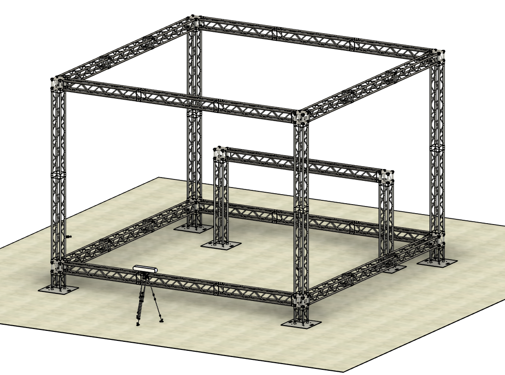

# UAV-cage
UAV cage at the University of South Carolina

# 3 camera OptiTrack system on Tripod
Hardware Model:  
Software Version: Use software 3.1.4 (final)  
Problems you might face: Markers doesn't appear in perspective view (3D), solution: switch the mode to grayscale, wave the markers very close to the cameras.

